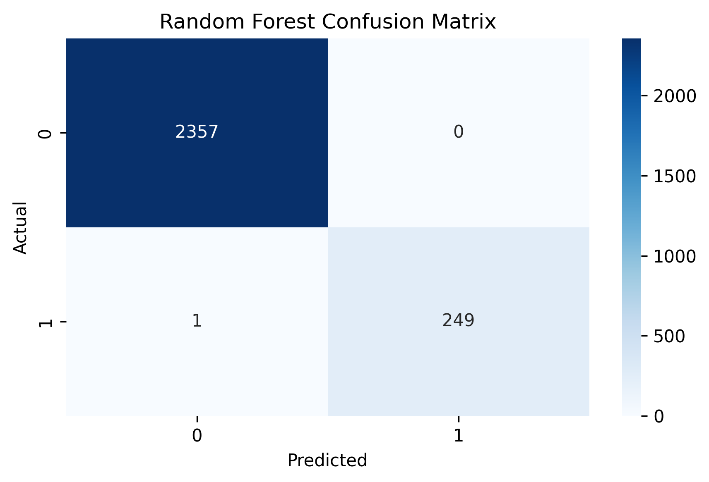

# Automated Screening of Haematological Disorders

This project uses **Machine Learning** to classify blood samples as *Normal* or *Abnormal* based on HPLC test data.

### 🧠 Overview
- **Language:** Python  
- **Libraries:** pandas, numpy, scikit-learn, matplotlib, seaborn, joblib  

### ⚙️ How to Run
1. Install dependencies  
   ```bash
   pip install -r requirements.txt
2. Run the script
    ```bash
   python classify_cells.py


### 📊 Dataset

Input: HPLC parameters (HbA0, HbA2, HbF, RBC, HB, etc.)

The project now uses an extended dataset (`HPLC_data_extended.csv`) with 50,000 samples, 
generated synthetically to improve generalization and reduce overfitting.

Output: Diagnosis (Normal / Abnormal)

### 📊 Results

| Model | Accuracy | Precision | Recall | F1-Score |
|--------|-----------|------------|---------|-----------|
| Logistic Regression | 99.41% | 0.99 | 0.99 | 0.99 |
| Random Forest | **99.68%** | 1.00 | 0.99 | 0.99 |
| SVM (RBF) | 99.55% | 0.99 | 0.99 | 0.99 |
| AdaBoost | 99.57% | 0.99 | 0.99 | 0.99 |
| Extra Trees | **99.73%** | 1.00 | 0.99 | 0.99 |

✅ **Extra Trees** achieved the highest overall accuracy (~99.7%) on the extended dataset, closely followed by **Random Forest**.
All models showed consistent precision, recall, and F1-scores, indicating robust classification performance across normal and abnormal cell samples.

*Confusion matrix for Random Forest on the extended dataset:*


